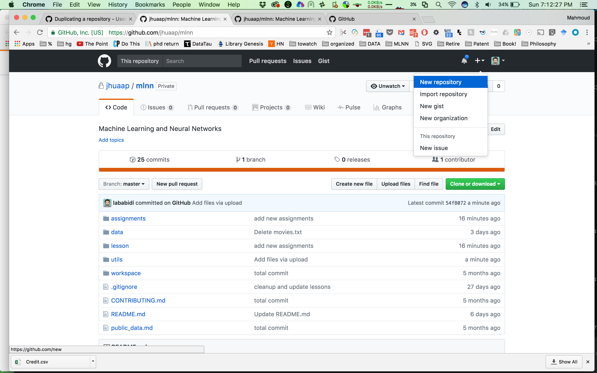

# Extra

## Git

### Creating a Personal Repository from the Course Repository
From 
https://help.github.com/articles/duplicating-a-repository/

First create a new repository and note the name. This will be `ML_PORTFOLIO_NAME`:


Please note to fill in `YOUR_USER_NAME` with your github username and `ML_PORTFOLIO_NAME` with your preferred portfolio repository name

```bash
git clone --bare https://github.com/jhuaap/mlnn.git
cd mlnn.git
git push --mirror https://github.com/YOUR_USER_NAME/ML_PORTFOLIO_NAME.git
cd ..
rm -rf mlnn.git
git clone https://github.com/YOUR_USER_NAME/ML_PORTFOLIO_NAME.git
```
### Pretty Terminal

Please only do this if you feel confident. Of course, I'll be available to help if you run into issues but this is pretty outside of the curriciulum!

We talked about having a "pretty" terminal. For Mac and Linux users, try using [oh-my-zsh](http://ohmyz.sh/).

This uses the `zsh` shell instead of the `bash` shell. This should be pre-installed on Macs. The oh-my-zsh install script will change your default shell to zsh for you.

**NOTE**: Your `~/.bash_profile` file will contain a line of code from Anaconda "initializing it" in your shell (essentially adding the "python" command from anaconda into your $PATH environment variable).

Looks like this:

```
➜   ~  cat ~/.bash_profile
# added by Anaconda3 2.5.0 installer
export PATH="/Users/johria/anaconda/bin:$PATH"
```

If you choose to use oh-my-zsh, you will have to copy the line that starts with `export` into your new `~/.zshrc` file that will be created by oh-my-zsh.

### Alias

In your `bash_profile` or now perhaps `zshrc` file, you can add aliases.

This is an example alias:

```
➜   ~  alias ls='ls -l'
➜   ~  ls -l
total 560
-rw-r--r--    1 johria 1978051377 563008 Feb  4 18:40 07_linear_regression.ipynb
drwx------   51 johria 1978051377   1734 Dec 16 12:24 Applications
drwx------+  59 johria 1978051377   2006 Mar 21 22:28 Desktop
drwxr-xr-x   55 johria 1978051377   1870 Mar 21 18:02 Development
drwx------+   4 johria 1978051377    136 Jan 12 11:16 Documents
drwx------+ 113 johria 1978051377   3842 Mar 21 18:08 Downloads
```

The alias will only remain active in the current shell session. When you open a new tab or new window, the alias will disappear unless you add it to your `bash_profile` or `zshrc`.

For example, I have:

```
alias cp='cp -iv'
alias rm='rm -i'
alias mv='mv -i'
```

in my `zshrc` file.

### Basic Terminal Shortcuts

|Key/Command|Description                                                 |
|-----------|------------------------------------------------------------|
|Ctrl + A   | Go to the beginning of the line you are currently typing on|
|Ctrl + E   | Go to the end of the line you are currently typing on      |
|Ctrl + L   | Clears the Screen                                          |
|Command + K| Clears the Screen                                          |
|Ctrl + U   | Clears the line before the cursor position                 |
|Ctrl + C   | Kill whatever you are running                              |
|Ctrl + D   | Exit the current shell                                     |
|Tab        | Auto-complete files and folder names                       |
|Ctrl + K   | Clear the line after the cursor                            |

### Tree command

- Tree command on Windows in Git Bash: http://superuser.com/questions/531592/how-do-i-add-the-tree-command-to-git-bash-on-windows
- Tree Command on Mac
  ```
  brew install tree
  tree
  ```

### subl command line for sublime

1. Uninstall Sublime Text 3
2. Run the following commands.

   ```
   brew cask
   brew tap caskroom/versions
   brew cask install sublime-text3
   ```

This will re-install Sublime Text 3 with `subl` enabled on the command line.

### Resources

- Complete these Code Academy Courses if you feel uncomfortable with Python or the Git:
	- https://www.codecademy.com/learn/python
	- https://www.codecademy.com/learn/learn-git
